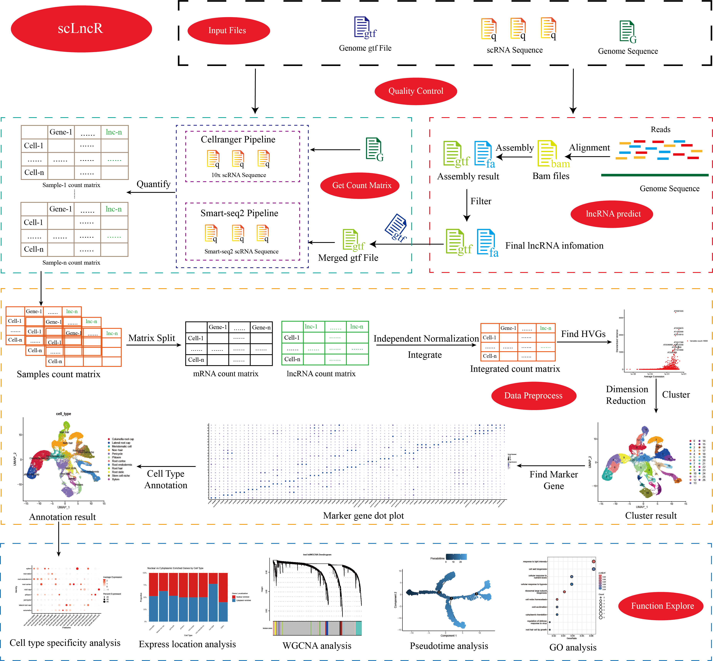

# scLncR

A pipeline to predict and analyze lncRNAs from single-cell RNA-seq data.

scLncR supports raw FASTQ quality control, candidate lncRNA prediction, lncRNA-aware quantification, data preprocessing, normalization benchmarking, downstream functional analysis, and a Shiny GUI interface.



---

## Download

```text
git clone https://github.com/Lilab-SNNU/scLncR.git
```

---

## Install

### Conda environment

You can configure the scLncR environment using conda.

```text
cd scLncR
conda env create -f scLncR.yaml
conda activate scLncR

# Make the scLncR launcher executable
chmod +x scLncR

# Add scLncR to PATH permanently for bash users
echo "export PATH=\"$(pwd):\$PATH\"" >> ~/.bashrc
source ~/.bashrc

# Test installation
scLncR -h
```

The `scLncR` launcher automatically sets `SC_LNCR_HOME` before calling the R entry script. Users normally only need to add the repository directory to `PATH`.

If you need complete environment reproduction, exported environment files are available in `envs/`.

### Independent R package and Cellranger installation

Some optional downstream packages may need independent installation depending on your R/conda setup, especially `hdWGCNA` and `scMayoMap`.

```r
install.packages("BiocManager")
BiocManager::install()

devtools::install_github("smorabit/hdWGCNA", ref = "dev")
devtools::install_github("chloelulu/scMayoMap")
```

If you want get more information of `hdWGCNA` and `scMayoMap`, you can found then in their GitHub repositories.

Cellranger also needs to be installed.
```shell
cd /opt
# [Download file from downloads page https://www.10xgenomics.com/support/software/cell-ranger/downloads/previous-versions]
tar -xzvf cellranger-7.2.0.tar.gz
export PATH=/opt/cellranger-7.2.0:$PATH
cellranger -V ## Check cellranger
```

### R package list

If you do not use conda, install the required R packages manually.

- seurat, version 4.3.0.1(https://satijalab.org/seurat/)
- seuratobject, version 4.1.3(https://satijalab.org/seurat/)
- monocle2, version 2.30.0(https://cole-trapnell-lab.github.io/monocle-release/docs/)
- hdWGCNA, version 0.4.4(https://smorabit.github.io/hdWGCNA/)
- stringr, version 1.5.1(https://cran.r-project.org/web/packages/stringr/index.html)
- singler, version 2.4.0(https://bioconductor.org/packages//release/bioc/html/SingleR.html)
- scmayomap, version 1.0.0(https://github.com/chloelulu/scMayoMap)
- tidyverse, version 2.0.0(https://www.tidyverse.org/)
- this.path, version 2.5.0(https://cran.r-project.org/web/packages/this.path/index.html)
- dplyr, version 1.1.4(https://dplyr.tidyverse.org/)
- psych, version 2.4.3(https://www.rdocumentation.org/packages/psych)
- pheatmap, version 1.0.12(https://cran.r-project.org/web/packages/pheatmap/index.html)
- ggsci, version 3.1.0(https://cran.r-project.org/web/packages/ggsci/index.html)
- ggplot2, version 3.5.1(https://ggplot2.tidyverse.org/)
- gridextra, version 2.3(https://cran.r-project.org/web/packages/gridExtra/index.html)
- patchwork, version 1.2.0(https://patchwork.data-imaginist.com/)
- reshape2, version 1.4.4(https://cran.r-project.org/web/packages/reshape2/index.html)
- yaml, version 2.3.10(https://cran.r-project.org/web/packages/yaml/index.html)
- optparse, version 1.7.5(https://cran.r-project.org/web/packages/optparse/index.html)
- shiny, version 1.8.1.1(https://shiny.posit.co/)
- shinyjs, version 2.1.0(https://cran.r-project.org/web/packages/shinyjs/index.html)
- shinybs, version 0.61.1(https://cran.r-project.org/web/packages/shinyBS/index.html)
- shinydashboard, 0.7.3(https://cran.r-project.org/web/packages/shinydashboard/index.html)
- shinydashboardplus, version 2.0.6(https://cran.r-project.org/web/packages/shinydashboardPlus/index.html)
- shinyfiles, version 0.9.3(https://cran.r-project.org/web/packages/shinyFiles/index.html)
- shinywidgets, version 0.9.0(https://cran.r-project.org/web/packages/shinyWidgets/index.html)

### Bioinformatics software

Install the command-line tools required by the modules you plan to run.

- hisat2,  version  2.2.1(https://daehwankimlab.github.io/hisat2/)
- samtools, version 1.20(https://www.htslib.org/)
- stringtie,  version  2.2.3(https://ccb.jhu.edu/software/stringtie/)
- gffcompare, version 0.12.6(https://ccb.jhu.edu/software/stringtie/gffcompare.shtml)
- gffread, version 0.9.12(https://ccb.jhu.edu/software/stringtie/gff.shtml#gffread)
- CPC2, version 1.0.1(https://github.com/gao-lab/CPC2_standalone/releases/tag/v1.0.1)
- Cell Ranger，version 7.0.2(https://github.com/10XGenomics/cellranger/releases)


Check whether the main tools are available:

```text
which fastqc
which multiqc
which hisat2
which samtools
which stringtie
which gffcompare
which gffread
which CPC2.py
which cellranger
which featureCounts
```

---

## Usage

scLncR supports command-line operation and a Shiny GUI interface.

### Command-line usage

```text
scLncR -h
```

Main commands:

```text
scLncR qc -c R/confings/config_QC.yaml
scLncR prelnc -c R/confings/config_LncPre.yaml
scLncR count -c R/confings/config_Count.yaml
scLncR dataProcess -c R/confings/config_dataProcess.yaml
scLncR function -c R/confings/config_function.yaml
```

Each command has its own help page:

```text
scLncR qc --help
scLncR prelnc --help
scLncR count --help
scLncR dataProcess --help
scLncR function --help
scLncR shiny --help
```

### Step-by-step workflow

#### Step 0. Raw FASTQ quality control

```text
scLncR qc -c R/confings/config_QC.yaml
```

This step runs FastQC and MultiQC only. It does not trim, filter, remove adapters, or modify raw FASTQ files.

#### Step 1. Candidate lncRNA prediction

```text
scLncR prelnc -c R/confings/config_LncPre.yaml
```

The prelnc module starts from raw FASTQ, performs technology-aware alignment and transcript assembly, filters candidate lncRNAs, and generates:

```text
final_lnc.gtf
final.lncRNA.fa
reference/combined_mRNA_lncRNA.gtf
```

#### Step 2. Single-cell count matrix getting

```text
scLncR count -c R/confings/config_Count.yaml
```

For 10x data, scLncR builds a Cell Ranger reference using the augmented annotation and runs Cell Ranger count from raw FASTQ.

For Smart-seq2 data, scLncR uses HISAT2, samtools, and featureCounts.

#### Step 3. Data Processing

```text
scLncR dataProcess -c R/confings/config_dataProcess.yaml
```

This step creates a Seurat object, performs QC, normalization, feature selection, dimensional reduction, clustering, and optional annotation.


#### Step 4. Downstream function explore

```text
scLncR function -c R/confings/config_function.yaml
```

The function module currently includes:

- snRNA/scRNA expression enrichment analysis
- Monocle2 trajectory analysis
- WGCNA co-expression network analysis

The `location` key in `config_function.yaml` is retained for backward compatibility. It should be interpreted as snRNA/scRNA expression enrichment, not direct nuclear/cytoplasmic localization.

---

## 10x workflow notes

For 10x-style FASTQ:

- `I1`: sample index read
- `R1`: cell barcode / UMI read
- `R2`: cDNA / insert read

In 10x prelnc mode, scLncR uses R2 cDNA reads as candidate transcript evidence. R1 and I1 are retained in the manifest for traceability.

Standard 10x 3'/5' data do not provide uniform full-length transcript coverage. Predicted lncRNAs from this mode should be interpreted as candidate transcript evidence, not full-length reconstruction.

The count step uses raw FASTQ again with Cell Ranger and the augmented reference.

---

## Smart-seq2 workflow notes

Smart-seq2 is full-length-like single-cell RNA-seq and should not be processed with Cell Ranger.

Smart-seq2 count uses:

```text
Raw FASTQ -> HISAT2 -> samtools -> featureCounts -> smartseq2_count_matrix.tsv
```

The main count matrix is:

```text
featurecounts/smartseq2_count_matrix.tsv
```

For Smart-seq2 dataProcess, use:

```yaml
input_format: "featurecounts_matrix"
```

---

## Module overview

| Module | Function |
| --- | --- |
| `qc` | Raw FASTQ quality control with FastQC and MultiQC |
| `prelnc` | Candidate lncRNA prediction and augmented reference construction |
| `count` | 10x Cell Ranger count or Smart-seq2 featureCounts quantification |
| `dataProcess` | Seurat preprocessing and optional annotation |
| `function` | snRNA/scRNA enrichment, Monocle2, and WGCNA |
| `shiny` | Graphical user interface |

---

## Configuration files

Main configuration files:

```text
R/confings/config_QC.yaml
R/confings/config_LncPre.yaml
R/confings/config_Count.yaml
R/confings/config_dataProcess.yaml
R/confings/config_function.yaml
```

Users should edit paths, project name, lncRNA prefix, genome FASTA, GTF annotation, sequencing platform, and output directories before running.

---

## Output overview

| Step | Main output |
| --- | --- |
| QC | FastQC reports, MultiQC report, `qc_summary.md` |
| prelnc | `final_lnc.gtf`, `final.lncRNA.fa`, `reference/combined_mRNA_lncRNA.gtf` |
| 10x count | Cell Ranger `filtered_feature_bc_matrix` |
| Smart-seq2 count | `featurecounts/smartseq2_count_matrix.tsv` |
| dataProcess | `data_preprocess/preprocessed_result.rds`, `data_annotation/anno_result.rds` |
| function | enrichment, trajectory, and WGCNA results |


---

## Run scLncR in graphical user interface

### Method 1. Open Shiny in RStudio

Open RStudio and select:

```text
File -> New Project -> Existing Directory -> Select the scLncR directory
```

Then open:

```text
shiny_app/app.R
```

Click `Run App`, or run in the R console:

```r
setwd("/path/to/scLncR/shiny_app")
shiny::runApp()
```

### Method 2. Open Shiny from command line

```shell
$ scLncR shiny
### Then Open the port print in shell,such as 
Setting up environment...
Found scLncR at: opt/scLncR/scLncR
Installation directory: opt/scLncR
Launching Shiny app from: opt/scLncR/shiny_app
Server will be available at: http://localhost:3838
Press Ctrl+C to stop the server


Listening on http://0.0.0.0:3838
```
Then, click the link or open the IP in your browser.

You can get the GUI:


On a remote server, open the printed host and port through your browser or SSH tunnel according to your server policy.

---

## Contact us

If you encounter any problems while using scLncR, please send an email to the maintainers or submit an issue on GitHub:

```text
https://github.com/Lilab-SNNU/scLncR/issues
```
