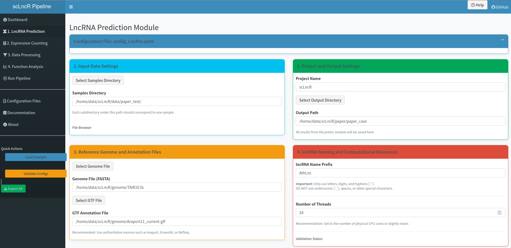

# scLncR
A pipeline to predict and analysis lncRNA from scRNA-seq.


---
### Download
```shell
$ git clone https://github.com/Lilab-SNNU/scLncR.git
```
---

### Install
#### Enveriment 

You can configure scLncR environment using conda.
```shell
$ cd scLncR
$ conda env create -f scLncR.yaml 

$ # Make the scLncR launcher executable
$ chmod +x scLncR

$ # Add scLncR to PATH permanently for bash users
$ echo "export PATH=\"$(pwd):\$PATH\"" >> ~/.bashrc

$ # Reload shell configuration
$ source ~/.bashrc

$ # Test installation
$ conda activate scLncR
$ scLncR -h
```

The R package of hdWGCNA and scMayoMap need install independent in terminal or Rstudio.
```R
# install Bioconductor
install.packages("BiocManager")
BiocManager::install()

# install hdWGCNA from GitHub
devtools::install_github('smorabit/hdWGCNA', ref='dev')

# install scMayoMap from GitHub
devtools::install_github("chloelulu/scMayoMap")

## Detailed installation instructions and dependencies for hdWGCNA and scMayoMap can be found in theirgithub repositories.
```

If you do not have conda, you can also manually install the required R packages listed below.

**R package list**
- seurat, version 4.3.0.1(https://satijalab.org/seurat/)
- seuratobject, version 4.1.3(https://satijalab.org/seurat/)
- monocle2, version 2.30.0(https://cole-trapnell-lab.github.io/monocle-release/docs/)
- hdWGCNA, version 0.4.4(https://smorabit.github.io/hdWGCNA/)
- stringr, version 1.5.1(https://cran.r-project.org/web/packages/stringr/index.html)
- singler, version 2.4.0(https://bioconductor.org/packages//release/bioc/html/SingleR.html)
- scmayomap, version 1.0.0(https://github.com/chloelulu/scMayoMap)
- tidyverse, version 2.0.0(https://www.tidyverse.org/)
- this.path, version 2.5.0(https://cran.r-project.org/web/packages/this.path/index.html)
- dplyr, version 1.1.4(https://dplyr.tidyverse.org/)
- psych, version 2.4.3(https://www.rdocumentation.org/packages/psych)
- pheatmap, version 1.0.12(https://cran.r-project.org/web/packages/pheatmap/index.html)
- ggsci, version 3.1.0(https://cran.r-project.org/web/packages/ggsci/index.html)
- ggplot2, version 3.5.1(https://ggplot2.tidyverse.org/)
- gridextra, version 2.3(https://cran.r-project.org/web/packages/gridExtra/index.html)
- patchwork, version 1.2.0(https://patchwork.data-imaginist.com/)
- reshape2, version 1.4.4(https://cran.r-project.org/web/packages/reshape2/index.html)
- yaml, version 2.3.10(https://cran.r-project.org/web/packages/yaml/index.html)
- optparse, version 1.7.5(https://cran.r-project.org/web/packages/optparse/index.html)
- shiny, version 1.8.1.1(https://shiny.posit.co/)
- shinyjs, version 2.1.0(https://cran.r-project.org/web/packages/shinyjs/index.html)
- shinybs, version 0.61.1(https://cran.r-project.org/web/packages/shinyBS/index.html)
- shinydashboard, 0.7.3(https://cran.r-project.org/web/packages/shinydashboard/index.html)
- shinydashboardplus, version 2.0.6(https://cran.r-project.org/web/packages/shinydashboardPlus/index.html)
- shinyfiles, version 0.9.3(https://cran.r-project.org/web/packages/shinyFiles/index.html)
- shinywidgets, version 0.9.0(https://cran.r-project.org/web/packages/shinyWidgets/index.html)


**Bioinformatics Software**
- hisat2,  version  2.2.1(https://daehwankimlab.github.io/hisat2/)
- samtools, version 1.20(https://www.htslib.org/)
- stringtie,  version  2.2.3(https://ccb.jhu.edu/software/stringtie/)
- gffcompare, version 0.12.6(https://ccb.jhu.edu/software/stringtie/gffcompare.shtml)
- gffread, version 0.9.12(https://ccb.jhu.edu/software/stringtie/gff.shtml#gffread)
- CPC2, version 1.0.1(https://github.com/gao-lab/CPC2_standalone/releases/tag/v1.0.1)
- Cell Ranger，version 7.0.2(https://github.com/10XGenomics/cellranger/releases)
---

### Usage
scLncR supports two modes of usage: command-line operation and a Shiny GUI interface.

For the `function` module, the `location` submodule should be interpreted as **snRNA/scRNA expression enrichment analysis** (snRNA-enriched, scRNA-enriched, or balanced/non-differential expression).  
These results come from differential expression between snRNA-seq and scRNA-seq groups and should not be used alone as proof of true nuclear/cytoplasmic localization without independent validation.

### Normalization benchmarking and stability analysis
To evaluate whether separate normalization changes lncRNA marker detection and downstream signal stability, scLncR provides an independent benchmarking script:

```shell
Rscript scripts/run_normalization_benchmark.R \
  -c R/confings/config_normalization_benchmark.yaml
```

Configure input/output and strategies in:

```text
R/confings/config_normalization_benchmark.yaml
```

Main output directory:

```text
normalization_benchmark_results/
├── normalized_objects/
├── markers/
├── stability/
├── figures/
└── normalization_benchmark_report.md
```

The benchmark summarizes:
- lncRNA marker counts and proportions across normalization strategies;
- marker overlap and rank consistency (Jaccard and rank correlation);
- lncRNA and mRNA normalized signal distribution summaries;
- lightweight downstream stability proxies (lncRNA HVG overlap and group-level average-expression correlation).

This module is intended to assess stability and sensitivity, not to prove that one normalization strategy is universally superior.  
`separate_lognormalize` remains available, but users are encouraged to run this benchmark and report strategy-dependent uncertainty where needed.

### Raw FASTQ quality control
Before running candidate lncRNA discovery or lncRNA-aware quantification, users can optionally inspect raw FASTQ quality with FastQC and MultiQC:

```shell
scLncR qc -c R/confings/config_QC.yaml
```

The same workflow can be launched through the shell wrapper:

```shell
bash scripts/run_fastq_qc.sh -c R/confings/config_QC.yaml
```

This module only reports quality metrics. It does not perform trimming, adapter removal, low-quality read filtering, or any modification of raw FASTQ files. Users should inspect the MultiQC HTML report and decide whether the raw data are suitable for downstream prelnc/count analysis.

Default QC output layout:

```text
output_dir/
├── fastqc/
│   ├── *_fastqc.html
│   ├── *_fastqc.zip
│   └── *_fastqc/
├── multiqc/
│   ├── multiqc_report.html
│   └── multiqc_data/
├── logs/
│   ├── qc_run.log
│   ├── commands.log
│   └── fastq_file_list.txt
└── qc_summary.md
```

Main configuration file:

```text
R/confings/config_QC.yaml
```

### Raw FASTQ-first technology-aware workflow
scLncR starts from **raw sequencing FASTQ** and performs technology-aware lncRNA analysis.

High-level flow:

Raw FASTQ  
→ technology-aware input parsing  
→ discovery alignment  
→ transcript assembly  
→ candidate lncRNA filtering  
→ augmented reference construction  
→ technology-aware quantification  
→ mRNA + lncRNA count matrix  
→ downstream scLncR analysis

Key design principles:
- prelnc uses raw FASTQ as the user-facing input;
- BAM files are internal intermediate files for transcript evidence;
- count stage reuses raw FASTQ together with augmented reference for lncRNA-aware quantification.

Technology-aware prelnc notes:
- 10x (primary supported plant scRNA workflow): `I1` sample index, `R1` barcode/UMI, `R2` cDNA;
- 10x prelnc discovery uses **R2** for candidate transcript evidence; `R1/I1` are retained for traceability;
- standard 10x 3'/5' data do not provide uniform full-length transcript coverage, so predictions should be interpreted as **candidate transcript evidence** and cross-validated when possible;
- Smart-seq2 supports paired-end and single-end discovery alignment;
- Drop-seq interface is provided as experimental/planned for full UMI-aware quantification integration.

Default prelnc output layout (raw FASTQ-first):

```text
output_path/
├── manifest/
│   ├── prelnc_raw_fastq_manifest.tsv
│   ├── prelnc_input_validation_report.md
│   └── samples_info.copy.tsv
├── logs/
│   ├── prelnc_run.log
│   ├── commands.log
│   └── per_sample_status.tsv
├── index/hisat2/
├── alignment/sam/
├── alignment/sorted_bam/
├── assembly/stringtie/per_sample_gtf/
├── assembly/stringtie/all.merged.gtf
├── gffcompare/
├── cpc2/
├── reference/
│   └── combined_mRNA_lncRNA.gtf
├── final_lnc.gtf
├── final.lncRNA.fa
└── prelnc_run_report.md
```

prelnc→count bridge:
- `final_lnc.gtf` is the predicted candidate lncRNA annotation;
- `reference/combined_mRNA_lncRNA.gtf` is the augmented annotation for count;
- 10x quantification uses raw FASTQ + augmented reference via Cell Ranger.
- Smart-seq2 quantification uses raw FASTQ + augmented reference via HISAT2, samtools, and featureCounts.

Run prelnc:

```shell
scLncR prelnc -c R/confings/config_LncPre.yaml
```

### Smart-seq2 count workflow
Smart-seq2 is full-length-like single-cell RNA-seq and should not be processed with Cell Ranger. For Smart-seq2, scLncR uses HISAT2 alignment, samtools BAM sorting/indexing, and featureCounts gene-level quantification against the augmented `combined_mRNA_lncRNA.gtf` from prelnc.

Example command:

```shell
scLncR count -c R/confings/config_Count.yaml
```

Example configuration fragment:

```yaml
sequencing_platform: "smartseq2"
count_engine: "featurecounts"
samples_dirs: "/path/to/smartseq2_fastq"
combined_gtf: "/path/to/step_LncPre/reference/combined_mRNA_lncRNA.gtf"
read_layout: "paired"      # auto | paired | single
strandness: "unstranded"   # unstranded | FR | RF
```

Smart-seq2 count output:

```text
output_path/
├── manifest/
│   ├── smartseq2_fastq_manifest.tsv
│   └── count_input_validation_report.md
├── logs/
│   ├── count_run.log
│   ├── commands.log
│   └── per_sample_status.tsv
├── index/hisat2/
├── alignment/sam/
├── alignment/sorted_bam/
├── featurecounts/
│   ├── smartseq2_featureCounts.txt
│   ├── smartseq2_featureCounts.txt.summary
│   ├── smartseq2_count_matrix.tsv
│   └── smartseq2_count_matrix.rds
└── count_run_report.md
```

The main matrix is `featurecounts/smartseq2_count_matrix.tsv`: rows are `gene_id` values from the augmented GTF and columns are Smart-seq2 sample IDs. StringTie abundance is not used as the primary count matrix because featureCounts provides direct gene-level counts from the augmented annotation.

### Smart-seq2 dataProcess and normalization benchmark

Smart-seq2 featureCounts output can enter `dataProcess` through the featureCounts matrix input mode. This keeps the existing 10x `filtered_feature_bc_matrix` input path unchanged.

Example configuration fragment:

```yaml
input_format: "featurecounts_matrix"
sequencing_platform: "smartseq2"
counts_matrix: "/path/to/featurecounts/smartseq2_count_matrix.tsv"
samples_info: "/path/to/samples_info.txt"
anno_method: "none"
lnc_name: "AthLnc"
```

Example commands:

```shell
scLncR dataProcess -c R/confings/examples/config_dataProcess.smartseq2.yaml
Rscript scripts/run_normalization_benchmark.R -c R/confings/examples/config_normalization_benchmark.smartseq2.yaml
```

Smart-seq2 example YAML files are available under `R/confings/examples/`.

### Command-line usage:
***scLncR Main Program***
```shell
$ scLncR -h
scLncR v0.1.0 - Single-cell lncRNA Discovery Pipeline
Usage: scLncR <command> [options]

Available commands:
  qc            Raw FASTQ quality control (FastQC + MultiQC; no trimming)
  prelnc        Candidate lncRNA discovery (raw FASTQ-first, technology-aware)
  count         lncRNA-aware quantification (raw FASTQ-first interface)
  dataProcess   ScRNA-seq expression count preprocess and annotation 
  function      DownStream analysis to explore lncRNA function 
  shiny         Launch Shiny GUI

Examples:
  scLncR prelnc -c config.yaml
  scLncR prelnc --help

Options:
  -h, --help    Show this global help message

Note: Each command has its own --help. For example:
      scLncR prelnc --help
```
scLncR allows each subroutine to accept corresponding parameters via YAML configuration files. Users can modify the settings according to the parameter specifications provided in each YAML file and then execute the program sequentially using the following command. Alternatively, they may run specific modules independently based on their needs.

```shell
$ scLncR qc -c scLncR/R/confings/config_QC.yaml
$ scLncR prelnc -c scLncR/R/confings/config_LncPre.yaml
$ scLncR count -c scLncR/R/confings/config_Count.yaml
$ scLncR dataProcess -c scLncR/R/confings/config_dataProcess.yaml
$ scLncR function -c scLncR/R/confings/config_function.yaml
```
### Run scLncR in graphical user interface(GUI) 
#### Method 1 :Open the shiny in Rstudio
```text
After opening RStudio, click the menu:
File → New Project → Existing Directory → Select the scLncR directory

In RStudio's file explorer:
1. Navigate to the scLncR/shiny_app directory
2. Double-click to open the app.R file

Method A: Using the Run Button
In the upper right corner of the app.R editor, click the "Run App" button.
Or click the drop-down arrow next to it and select the run port.

Method B: Using Keyboard Shortcuts
In the app.R file, press Ctrl + Shift + Enter (Windows/Linux)
Or Cmd + Shift + Enter (Mac)

Method C: Running in the Console
Ensure the working directory is correct:
setwd("/home/data/scLncR/scLncR/shiny_app")
shiny::runApp()
```
#### Method 2 :Open the shiny in command

```shell
$ scLCnR shiny
$ # Then Open the port print in shell,such as 
Setting up environment...
Found scLncR at: opt/scLncR/scLncR
Installation directory: opt/scLncR
Launching Shiny app from: opt/scLncR/shiny_app
Server will be available at: http://localhost:3838
Press Ctrl+C to stop the server


Listening on http://0.0.0.0:3838
```
Then, open the IP in your browser.

You can get the GUI:




---
## Contact us

If you encounter any problems while using scLncR, please send an email (glli@snnu.edu.cn) or submit the issues on GitHub (https://github.com/Lilab-SNNU/scLcnR/issues) and we will resolve it as soon as possible.
